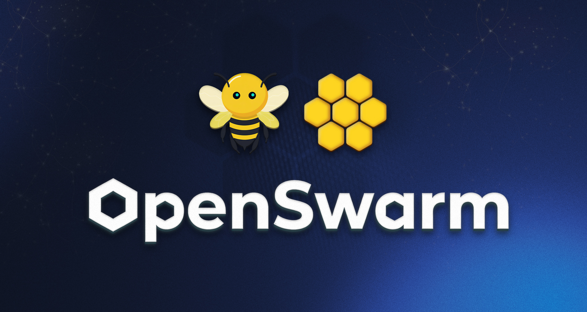

<div align="center">

# 🚀 OpenSwarm



</div>

**The fully open-source multi-agent system that does everything Claude Code can't.**

Create polished slide decks, research reports, data visualizations, documents, images, and videos — all from a single prompt in your terminal. No platform, no UI, no setup hassles.

✨ **One prompt → Complete deliverables**
🎯 **8 specialized agents working together**
⚡ **Install in 30 seconds, running in 60**
🔧 **100% customizable and forkable**

Built on [Agency Swarm](https://github.com/VRSEN/agency-swarm) — the framework powering real AI agencies.

---

> 💼 **Investor or looking to integrate AI agents into your SaaS?**
> We're the team behind OpenSwarm and Agency Swarm, building the future of multi-agent systems.
> **[Partner with us →](https://vrsen-ai.notion.site/fee2d391a8d74b24baa04a0b648af83c?pvs=105)**

---

## 💡 What Makes This Different?

Instead of one agent trying to do everything poorly, you get **specialists coordinated by an orchestrator**.

### 🎯 Real Examples

Paste these into your terminal and watch magic happen:

- **"Create a complete investor pitch for OpenSwarm"** → Full deck + executive summary + market research
- **"Research my top 5 competitors and write 3 SEO-optimized blog posts"** → Competitive analysis + keyword research + publish-ready content
- **"Analyze this data and create a quarterly report with charts"** → Data insights + visualizations + formatted document
- **"Generate a product launch video with animations"** → Professional video with graphics and transitions
- **"Build me a marketing campaign for Q2"** → Strategy doc + creative assets + implementation timeline

Connect to 10,000+ external services (Gmail, Slack, GitHub, HubSpot) via Composio for even more power.

---

## 🤖 Meet Your AI Team

| Agent                      | What it does                                                                                                                                                                                 |
| -------------------------- | -------------------------------------------------------------------------------------------------------------------------------------------------------------------------------------------- |
| **Orchestrator**           | Routes every user request to the right specialist(s). Never answers directly — pure coordination.                                                                                            |
| **Virtual Assistant**      | Handles everyday tasks: writing, scheduling, messaging, task management. Gains 10,000+ external integrations via [Composio](https://composio.dev) (Gmail, Slack, GitHub, HubSpot, and more). |
| **Deep Research**          | Conducts comprehensive, evidence-based web research with citations and balanced analysis.                                                                                                    |
| **Data Analyst**           | Analyses structured data, builds charts, runs statistical models — all inside an isolated IPython kernel.                                                                                    |
| **Slides Agent**           | Generates complete, visually polished HTML slide decks, then exports them to PPTX.                                                                                                           |
| **Docs Agent**             | Creates formatted Word documents and PDFs from outlines or raw content.                                                                                                                      |
| **Image Generation Agent** | Generates and edits images using Gemini 2.5 Flash Image / Gemini 3 Pro Image and fal.ai.                                                                                                     |
| **Video Generation Agent** | Produces videos via Sora (OpenAI), Veo (Google), and Seedance (fal.ai); also edits and combines clips.                                                                                       |

---

## 📦 Get Started in 30 Seconds

**For most users (recommended):**

```bash
npm install -g @vrsen/openswarm
openswarm
```

That's it! The setup wizard handles everything: authentication, dependencies, and configuration.

**Requirements:** Node.js 20+ (Python 3.10+ auto-installed)

## 🔧 Build Your Own Swarm

Fork this repo and create your own specialized AI team in minutes:

```bash
git clone https://github.com/VRSEN/openswarm.git
cd openswarm
```

Then tell **Claude Code**, **Cursor**, or **Codex**:

> _"Turn this into an SEO optimization swarm"_

They'll automatically customize all agents for your use case.

**Popular custom swarms:**

- **SEO Swarm:** Keyword research + competitor analysis + blog writing
- **Sales Swarm:** Lead research + outreach + proposal generation
- **Marketing Swarm:** Campaign planning + creative assets + analytics
- **Product Swarm:** Market research + feature specs + launch materials

## ⚙️ Authentication & Setup

The setup wizard can use multiple authentication sources at the same time:

**Subscription auth for reasoning agents:**

- `subscription/codex` - Uses your local Codex CLI login (`codex login`)
- `subscription/claude` - Uses your local Claude Code login (`claude auth login`)
- Subscription web search is available through `WebResearchSearch`; by default
  it uses Codex/Claude Code search first and falls back to API-backed search.

**API keys for direct provider APIs and media tools:**

- `OPENAI_API_KEY` - OpenAI API models, hosted web search fallback, OpenAI Images, and Sora video generation
- `ANTHROPIC_API_KEY` - Anthropic API models through LiteLLM
- `GOOGLE_API_KEY` - Gemini model/image generation + Veo video

**Optional superpowers:**

- `COMPOSIO_API_KEY` - Unlock 10,000+ integrations (Gmail, Slack, GitHub, etc.)
- `FAL_KEY` - Advanced video editing and effects
- `SEARCH_API_KEY` - SearchAPI fallback, Google Scholar search, and product search
- `PEXELS_API_KEY`, `PIXABAY_API_KEY`, `UNSPLASH_ACCESS_KEY` - stock image search

Check everything with:

```bash
uv run python onboard.py --status
```

Model calls do not have an OpenSwarm hard timeout by default. To opt into one,
set `OPENSWARM_MODEL_TIMEOUT_SECONDS` to a positive number of seconds; leave it
blank or set `0`/`none` to keep model calls unbounded until canceled or stopped
by the provider.

Tools gracefully degrade when keys are missing — you'll get clear instructions on what to add.

---

## 🚀 Coming Soon

- **Agent Builder Agent** - Create custom swarms from a single prompt
- **OpenClaw + Claude Code integration** - All agents in one place

⭐ **Star us on GitHub** to stay updated and help us prioritize features!

## 🏗️ For Developers

**Local development:**

```bash
git clone https://github.com/VRSEN/openswarm.git
cd openswarm
uv sync
uv run python run.py
```

OpenSwarm uses `uv` for local Python dependency management. `uv sync`
creates `.venv` from `pyproject.toml`; run Python commands through
`uv run ...` so they use that environment. For test dependencies, run
`uv sync --group dev`.

**Docker deployment:**

```bash
git clone https://github.com/VRSEN/openswarm.git
cd openswarm
cp .env.example .env        # Add your API keys
docker-compose up --build
```

**API server:**

```bash
uv run python server.py    # Runs on localhost:8080
```

**OpenSwarm TUI fork:**

This repo vendors the AgentSwarm/OpenCode TUI source under
`packages/openswarm-tui` so the auth flow and release binaries are controlled
from this project. The Python launcher passes backend auth status to the TUI
with `OPENSWARM_AUTH_MODE=backend`, which lets `/auth` show Codex, Claude Code,
API keys, and service status without requiring the native OpenAI browser login.

```bash
npm run test:tui
npm run build:tui
```

Tagged releases build `openswarm-tui-*` binaries from the vendored source via
`.github/workflows/build-tui.yml`. Set `OPENSWARM_TUI_URL` to test a custom
binary download URL locally.

**Project navigation:**

- [ARCHITECTURE.md](ARCHITECTURE.md) explains the system components and where
  to make changes.
- [CHANGELOG.md](CHANGELOG.md) tracks notable implementation and release
  changes.

**Project-local skills:**

OpenSwarm skills live in `openswarm_skills/<skill-name>/SKILL.md`. They are
provider-neutral instructions and read-only resources that agents can load
through shared tools, so they work the same across OpenAI, Codex subscription,
Claude Code subscription, Anthropic API, and future backends.

---

## 📺 Learn More

- **Watch the full demo:** [YouTube video →](https://youtu.be/c5DdXzqaeVU?si=rM2CNaZ8qVwMvqmz)
- **Multi-agent framework:** [Agency Swarm](https://github.com/VRSEN/agency-swarm)
- **External integrations:** [Composio](https://composio.dev)

---

## 📄 License

MIT — see [LICENSE](LICENSE).

**Built with ❤️ by the team behind [Agency Swarm](https://github.com/VRSEN/agency-swarm)**
